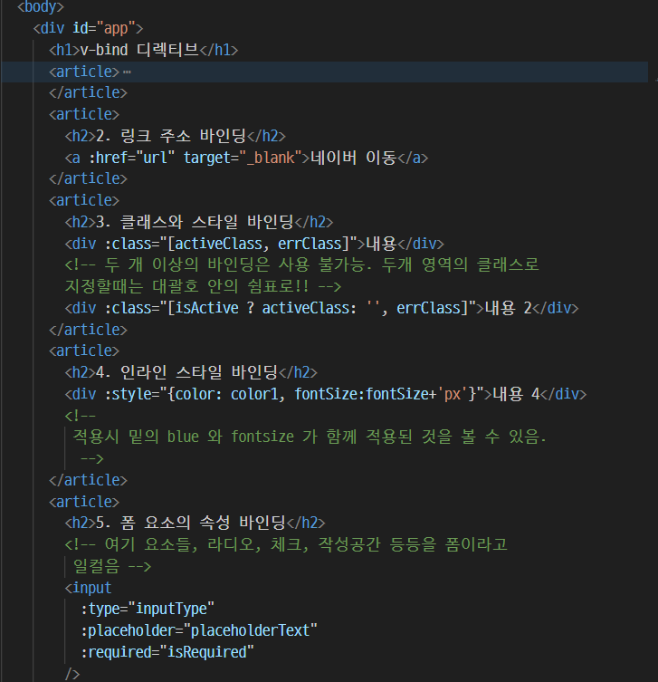

# 2025-03-20 vue 수업 내용 정리

## 01_html

1. 보간법

보간법: 두 값 사이의 중간값을 계산하는 방식.
데이터 바인딩.
문자열의 데이터 삽입, 동적으로 값을 추가하는 맥락에서 보간.

</img> 

<pre>
<code>

    

  </body>
</html>
</code>
</pre>

message에서 렌더링이 진행되기 전까지 적용이 안되는 것을 확인할 수 있음.

## 02.html

</img> 

<pre><code>
  <body>

    

  </body>
</code></pre>

html directive는 관리자 용도로만 사용하는 것이 적합함.

## 03.html

- https://picsum.photos/ 랜덤 사진 사이트.

## 04.html
